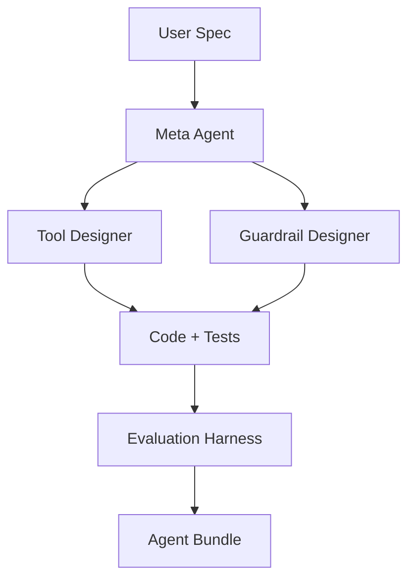

# Meta Agent

## Overview

Use **uv** for everything (`uv venv`, `uv pip install -r uv.lock`). We no longer use Hatch; hatchling only builds wheels.

## Requirements

Meta Agent is a Python application that automatically produces a fully-functional OpenAI Agents SDK agent (code + tests + guardrails) from a natural-language specification. It aims to eliminate hand-coding boilerplate, accelerate prototyping, and enforce best practices from day one.

## Problem Solved

Developers spend significant time translating English requirements into agent scaffolds, wiring tools, and writing safety checks. Meta Agent addresses this by automating these tasks.

## Target Users

Meta Agent is designed for:

*   **AI engineers**
*   **Solutions architects**
*   **Power users** who need bespoke agents quickly but may not have the time to invest in days of setup.
*   **Rapid Prototypers (“Alice”):** AI startup engineers needing a demo-ready agent quickly.
*   **Enterprise Solutions Architects (“Bob”):** Professionals integrating bespoke agents into client workflows, focusing on compliance and audit trails.
*   **Curious Hobbyists (“Charlie”):** Individuals exploring AI agents who may lack deep coding expertise.

## Value Proposition

Generate production-ready agents in minutes, with built-in validation, sandboxing, and documentation.

## Core Features

*   **Natural-language spec ingestion:** Accepts structured or free-form specifications describing goals, I/O contracts, tools, and constraints. This lowers the barrier to entry as there's no DSL to learn.
*   **Agent planner (Meta Agent):** Decomposes the specification, orchestrates sub-agents, and assembles the final artifact. It acts as the central logic hub, enforcing consistency and versioning.
*   **Tool Designer sub-agent:** Generates runnable Python code for each required tool and its unit tests, ensuring tools are functional from day one.
*   **Guardrail Designer sub-agent:** Creates validation logic (Pydantic, regex, policy checks) and guardrail tests, embedding safety and compliance early to prevent bad outputs.
*   **Automated evaluation harness:** Compiles generated code, executes unit tests, and surfaces results, guaranteeing that the agent "actually runs."
*   **Artifact bundle & dependency lock:** Outputs `agent.py`, `tests/`, `requirements.txt`, and an optional diagram. This allows for one-command install and run, ensuring reproducible builds.
*   **Cost & trace telemetry:** Logs token usage, latency, and spend per generation, helping to manage cloud costs and aid optimization.

## User Guide/How to Use

Meta Agent takes a natural-language specification as input, which can describe the agent's goals, input/output contracts, necessary tools, and constraints.

The output is a fully-functional OpenAI Agents SDK agent, including the Python code for the agent, unit tests, and safety guardrails.

Interaction with Meta Agent is primarily through a Command Line Interface (CLI).

### Key User Flows

*   **Create agent from scratch:**
    1.  Run the CLI and paste a specification or select a template.
    2.  Meta Agent generates the necessary files.
    3.  The user can then run the agent (e.g., `python my_agent.py --demo`).
    *   **Success signal:** The agent runs without error and passes auto-generated tests.
*   **Iterate on existing agent:**
    1.  Provide an updated specification.
    2.  Meta Agent performs a diff-parse of the changes and regenerates only the affected parts of the agent.
    *   **Success signal:** The modified agent works, and unchanged tests still pass.
*   **Inspect guardrails:**
    1.  Run an audit command (e.g., `--audit`).
    2.  The tool lists guardrail coverage and edge cases.
    *   **Success signal:** The developer can sign off on the guardrails or tweak the validators.

## Technical Architecture

The main components of Meta Agent include:

*   **Meta Agent Orchestrator:** Responsible for planning, sub-agent delegation, and artifact assembly. (Tech: `openai-agents-python`, model = o3)
*   **Tool Designer Agent:** Generates code and unit tests for tools. (Tech: model = o4-mini-high, sandboxed `python_interpreter`)
*   **Guardrail Designer Agent:** Creates validation logic and tests. (Tech: model = gpt-4o, Agents-SDK guardrails)
*   **Evaluation Harness:** Compiles, executes, and reports on tests. (Tech: Pytest in Docker with no outbound network access)

## Getting Started/Installation

1.  **Clone the repository:**
    ```bash
    git clone <repository_url>
    cd meta-agent
    ```
2.  **Set up Python environment and install dependencies:**
    It is recommended to use a virtual environment.
    ```bash
    python -m venv .venv
    source .venv/bin/activate  # On Windows use `.venv\Scriptsctivate`
    ```
    The project uses `pyproject.toml` for Python dependencies. Install the project and its test extras using pip:
    ```bash
    python -m pip install -e ".[test]"
    ```
    The `setup.sh` script also provides this command.

3.  **Node.js dependencies (if applicable for scripts):**
    The project includes a `package.json` for Node.js scripts. If you intend to use these scripts:
    ```bash
    npm install
    ```

4.  **Docker (for sandboxed execution):**
    Ensure Docker is installed and running if you plan to use features that rely on the sandboxed execution environment (like the Evaluation Harness). The `Dockerfile` provides the setup for the execution environment.

## Roadmap

*   **Phase 0 · Foundations:** CLI skeleton, SpecSchema, Meta Agent orchestrator stub, Docker sandbox.
*   **Phase 1 · MVP:**
    *   Natural-language ingestion → working `agent.py`
    *   Single Tool Designer/Guardrail flow
    *   Basic pytest harness
    *   Requirements lockfile generation.
*   **Phase 2 · Validation & Observability:**
    *   Guardrail test coverage report
    *   Cost/latency telemetry dashboard
    *   Compile-time linting (ruff/pyright).
*   **Phase 3 · Templates & UX polish:**
    *   Library of common agent archetypes
    *   Mermaid diagram auto-generation
    *   Colored CLI feedback.
*   **Phase 4 · Extensibility:**
    *   VS Code extension
    *   Plugin system for custom sub-agents
    *   API endpoints for SaaS version.
*   **Phase 5 · Enterprise Hardening:**
    *   RBAC, audit logs, SSO
    *   Policy engine integration
    *   Multi-tenant artifact store.

## Risks & Mitigations

*   **LLM hallucination → non-runnable code:**
    *   **Mitigation:** Automated compilation + retry loops; constrain generation via templates.
*   **Sandbox escape / malicious code:**
    *   **Mitigation:** Docker seccomp/apparmor, read-only FS, no outbound net unless allow-listed.
*   **OpenAI API cost spikes:**
    *   **Mitigation:** Telemetry guard; cost caps per generation; use cheaper models when possible.
*   **Spec ambiguity:**
    *   **Mitigation:** Meta Agent auto-asks clarifying questions; provide spec template wizard.
*   **External API drift:**
    *   **Mitigation:** Health-check tests; version pin APIs; regenerate tools on failure.
*   **Scope creep delaying MVP:**
    *   **Mitigation:** Strict phase gating; prioritize “agent builds, runs, tested” above all.

## Example Spec Template (YAML)

```yaml
goal: "Summarize Slack threads into daily digest"
io_contract:
  input: "Channel history (JSON)"
  output: "Markdown summary"
tools:
  - name: slack_api
    requirement: "Fetch channel messages"
guardrails:
  - "No PII leakage"
constraints:
  max_latency: 30s
  max_cost: $0.50
```

## Mermaid Diagram Sample

