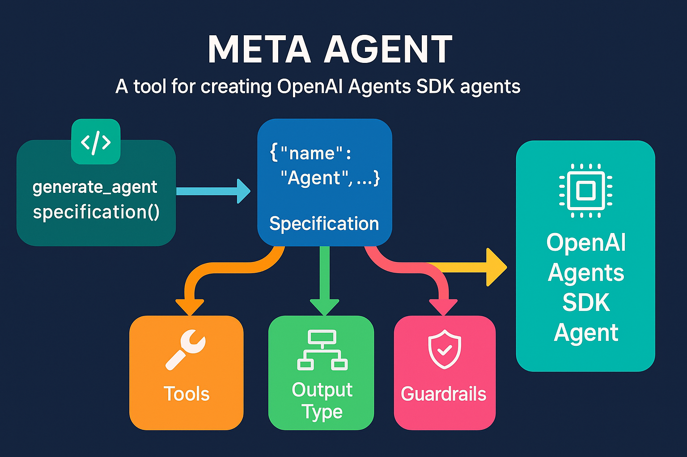

# Meta Agent for OpenAI Agents SDK  

This document provides instructions on how to use the Agent Generator tool to create self-contained agents using the OpenAI Agents SDK.



## Overview

The Agent Generator is a Python tool that takes an agent specification (in JSON or natural language format) and generates a single, runnable Python file that implements a self-contained agent using the OpenAI Agents SDK.

## Requirements

- Python 3.7+
- OpenAI Agents SDK (`pip install openai-agents`)
- OpenAI API key set as an environment variable (`OPENAI_API_KEY`)

## Usage

### Command Line

You can use the Agent Generator from the command line in two ways:

1. **With a specification file:**

```bash
python agent_generator.py path/to/specification.txt [output_file.py]
```

If you don't specify an output file, the generated agent will be saved to `generated_agent.py` by default.

2. **Interactive mode:**

```bash
python agent_generator.py
```

This will prompt you to enter your agent specification. Press Ctrl+D (Unix) or Ctrl+Z (Windows) when you're done.

### Agent Specification Format

The Agent Generator accepts specifications in two formats:

#### 1. JSON Format

```json
{
  "name": "WeatherAgent",
  "description": "An agent that provides weather information for different locations",
  "instructions": "You are a helpful weather assistant...",
  "tools": [
    {
      "name": "get_weather",
      "description": "Fetches current weather information for a location",
      "parameters": [
        {
          "name": "location",
          "type": "string",
          "description": "The name of the location (city, country, etc.)",
          "required": true
        },
        {
          "name": "units",
          "type": "string",
          "description": "The unit system to use (metric or imperial)",
          "required": false
        }
      ],
      "return_type": "string"
    }
  ],
  "output_type": {
    "name": "WeatherResponse",
    "fields": [
      {
        "name": "temperature",
        "type": "number",
        "description": "Current temperature",
        "required": true
      },
      {
        "name": "conditions",
        "type": "string",
        "description": "Weather conditions (sunny, cloudy, etc.)",
        "required": true
      }
    ]
  },
  "guardrails": [
    {
      "description": "Ensure responses are weather-related and helpful",
      "type": "output"
    }
  ]
}
```

#### 2. Natural Language Format

```
Name: WeatherAgent
Description: An agent that provides weather information for different locations

Instructions:
You are a helpful weather assistant. When users ask about the weather in a specific location, use the get_weather tool to fetch the current weather information and provide it in a friendly, conversational manner. If the user doesn't specify a location, ask them for one. You can also provide general weather-related advice.

Tools:
1. get_weather: Fetches current weather information for a location
   - location (string, required): The name of the location (city, country, etc.)
   - units (string, optional): The unit system to use (metric or imperial)
   - Returns: Weather information including temperature, conditions, and forecast

Guardrails:
- Ensure responses are weather-related and helpful
```

## Running the Generated Agent

The generated agent is a self-contained Python file that can be run directly:

```bash
python generated_agent.py
```

This will start an interactive session where you can chat with the agent. Type 'exit' to quit.

## Example

Here's an example of a simple weather agent specification:

```
Name: WeatherAgent
Description: An agent that provides weather information for different locations

Instructions:
You are a helpful weather assistant. When users ask about the weather in a specific location, use the get_weather tool to fetch the current weather information and provide it in a friendly, conversational manner. If the user doesn't specify a location, ask them for one. You can also provide general weather-related advice.

Tools:
1. get_weather: Fetches current weather information for a location
   - location (string, required): The name of the location (city, country, etc.)
   - units (string, optional): The unit system to use (metric or imperial)
   - Returns: Weather information including temperature, conditions, and forecast

Guardrails:
- Ensure responses are weather-related and helpful
```

Save this to a file (e.g., `weather_agent_spec.txt`) and run:

```bash
python agent_generator.py weather_agent_spec.txt
```

This will generate a file called `generated_agent.py` that implements the weather agent.

## Customizing the Generated Agent

The generated agent includes placeholder implementations for tools and guardrails. You'll need to replace these with actual implementations before using the agent in production.

For example, in the weather agent, you would replace the placeholder implementation of `get_weather` with code that actually fetches weather data from a weather API.

## Limitations

- The generated agent includes placeholder implementations for tools and guardrails
- The tool parameter types are limited to basic types (string, integer, boolean, etc.)
- Complex tool implementations need to be added manually after generation
