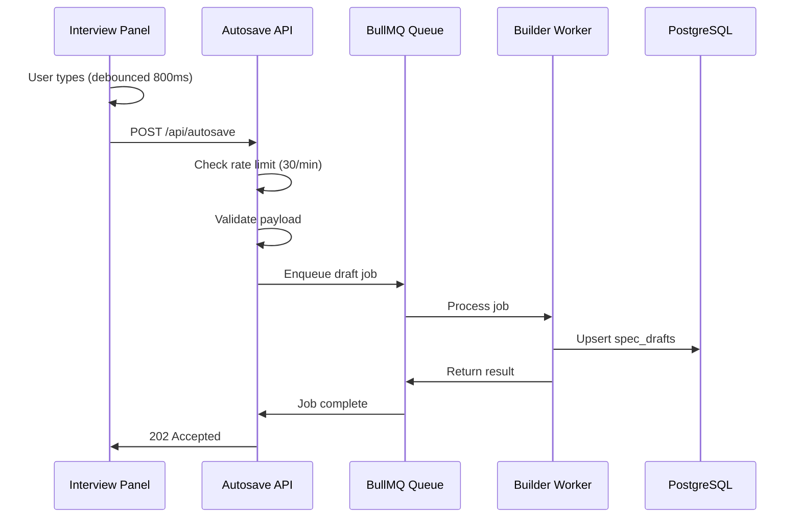

# Autosave System Runbook

## Overview

The autosave system enables automatic persistence of draft specs during the interview flow. It uses BullMQ for reliable background processing and includes rate limiting, validation, and error handling.

## Architecture



## Components

### 1. Client-Side Debouncing
**File**: `apps/web/app/components/InterviewPanel.tsx`
- Debounces autosave calls by 800ms to avoid excessive API requests
- Uses utility function from `apps/web/app/utils/schema.ts`

### 2. Autosave API Route
**File**: `apps/web/app/routes/api.autosave.ts`
- **Authentication**: Requires valid session via `requireUserId()`
- **Rate Limiting**: 30 requests per minute per user
- **Validation**: Title required (max 200 chars), payload max 500KB
- **Logging**: Structured logs for debugging and monitoring

### 3. BullMQ Queue
**File**: `packages/queue/src/queues.ts`
- Queue name: `draft-autosave`
- Job deduplication via job ID: `draft:${userId}:${draftId}`
- Retry configuration: 5 attempts with exponential backoff

### 4. Worker Handler
**File**: `services/builder/src/handlers/draftAutosave.ts`
- Processes autosave jobs asynchronously
- Handles both create and update operations
- Enforces user isolation via database RLS

## Monitoring

### Key Metrics
- **Autosave API response times**: Should be < 100ms
- **Queue processing latency**: Jobs should complete within seconds
- **Error rates**: Monitor failed jobs and API errors
- **Rate limit hits**: Track users hitting rate limits

### Log Patterns
```bash
# Normal operation
[autosave] Enqueuing draft autosave for user abc123, draft def456

# Rate limiting
[autosave] Rate limit exceeded for user abc123

# Validation errors
[autosave] Validation failed for user abc123: Payload too large (max 500KB)

# Processing errors
[autosave] Error processing autosave request: <error details>
```

## Troubleshooting

### Common Issues

#### 1. Redis Connection Issues
**Symptoms**: Queue jobs not processing, connection errors
**Solution**: 
- Check Redis server status
- Verify REDIS_URL environment variable
- Restart builder service

#### 2. High Error Rates
**Symptoms**: Failed autosave operations, database errors
**Solution**:
- Check database connectivity
- Verify user authentication is working
- Review RLS policies for spec_drafts table

#### 3. Rate Limit Issues
**Symptoms**: Users reporting autosave failures, 429 responses
**Solution**:
- Review rate limit settings (current: 30/minute)
- Check if legitimate usage patterns are being blocked
- Consider adjusting limits in `api.autosave.ts`

#### 4. Performance Issues
**Symptoms**: Slow autosave responses, queue backlog
**Solution**:
- Monitor queue worker concurrency (current: 10)
- Check database query performance
- Review payload sizes and validation overhead

### Recovery Procedures

#### Queue Cleanup
```bash
# Connect to Redis and clear failed jobs
redis-cli
FLUSHDB  # WARNING: Clears all data
```

#### Worker Restart
```bash
# Restart builder service to reset worker
docker-compose restart builder
# or
pm2 restart builder
```

#### Database Issues
```sql
-- Check for stuck RLS contexts
SELECT current_setting('app.current_user_id', true);

-- View recent draft activity
SELECT id, owner_user_id, title, updated_at 
FROM spec_drafts 
ORDER BY updated_at DESC 
LIMIT 10;
```

## Configuration

### Environment Variables
- `REDIS_URL`: Redis connection string for BullMQ
- `SESSION_SECRET_DEV`: Session encryption key (development)
- `DATABASE_URL`: PostgreSQL connection string

### Rate Limiting
**File**: `apps/web/app/routes/api.autosave.ts`
```typescript
const RATE_LIMIT_PER_MINUTE = 30;  // Adjust as needed
const RATE_LIMIT_WINDOW_MS = 60 * 1000;
```

### Worker Concurrency
**File**: `packages/queue/src/queues.ts`
```typescript
// Draft autosave worker
concurrency: opts?.concurrency ?? 10
```

### Payload Limits
**File**: `apps/web/app/routes/api.autosave.ts`
```typescript
// Title limit
if (body.title.length > 200) // chars

// Payload limit  
if (JSON.stringify(body.payload).length > 500 * 1024) // 500KB
```

## Testing

### Manual Testing
1. Open `/builder` route
2. Start interview flow
3. Type answers and observe autosave behavior
4. Check network tab for API calls (should be debounced)
5. Verify drafts appear in `/catalog/drafts`

### Load Testing
```bash
# Simulate high autosave load
curl -X POST http://localhost:3000/api/autosave \
  -H "Content-Type: application/json" \
  -H "Cookie: _metaagent_session=..." \
  -d '{"title": "Test", "payload": {}}'
```

### Queue Inspection
```bash
# View queue stats (requires BullMQ Dashboard or Redis CLI)
redis-cli
LLEN bull:draft-autosave:waiting
LLEN bull:draft-autosave:completed
LLEN bull:draft-autosave:failed
```

## Alerts & Monitoring

### Recommended Alerts
- **High error rate**: > 5% API errors over 5 minutes
- **Queue backlog**: > 100 waiting jobs
- **Response time**: P95 > 500ms for autosave API
- **Redis connectivity**: Connection failures

### Health Checks
- **API Health**: `GET /api/autosave` (should return 405 Method Not Allowed)
- **Queue Health**: Monitor Redis connection in builder service logs
- **Database Health**: Check spec_drafts table accessibility

## Performance Tuning

### Client-Side
- Adjust debounce timing: Currently 800ms in `InterviewPanel.tsx`
- Consider implementing exponential backoff for failed requests

### Server-Side
- Tune worker concurrency based on load
- Optimize database upsert queries
- Consider implementing job batching for high-volume users

### Database
- Ensure proper indexing on spec_drafts table
- Monitor connection pool utilization
- Consider read replicas for catalog queries
