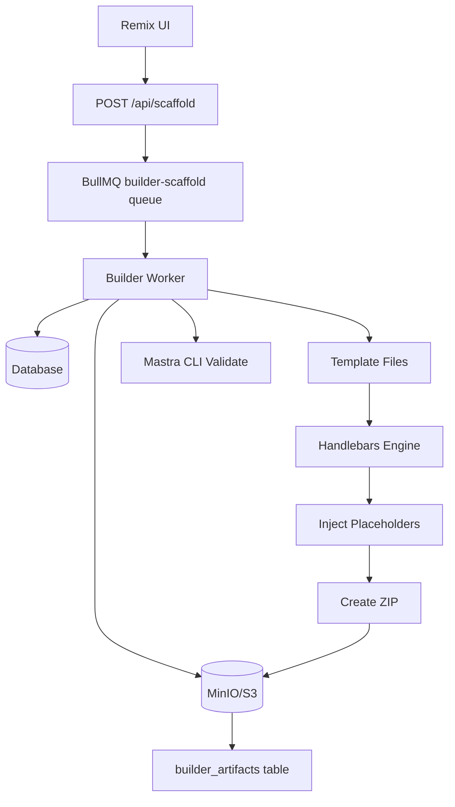

# Project Scaffolder

The project scaffolder is responsible for generating valid Mastra projects from user specifications and templates. It implements Week 3 of the delivery plan: scaffolding projects to object storage with placeholder injection.

## Overview

The scaffolder transforms a spec draft + template into a fully functional Mastra project ZIP file stored in object storage (S3/MinIO), ready for download or further processing in the build pipeline.

## Architecture



## Components

### 1. Templates System

Templates are stored in `packages/templates/files/` with the following structure:

```
packages/templates/files/
├── chatbot/
│   ├── package.json          # {{meta.name}}, {{default meta.version "1.0.0"}}
│   ├── tsconfig.json         # Standard TypeScript config
│   ├── src/mastra/index.ts   # Mastra entry point
│   ├── README.md             # {{title}}, {{default meta.description "..."}}
│   └── .env.example          # Environment template
├── web-automation/
│   └── ...
└── api-copilot/
    └── ...
```

Each template contains:
- **Boilerplate files**: Standard Mastra project structure
- **Placeholder tokens**: `{{token}}` syntax for dynamic values
- **Template metadata**: Defined in `packages/templates/src/templates.ts`

### 2. Placeholder Engine

Uses Handlebars with custom helpers:

- `{{meta.name}}` - Direct property access
- `{{default meta.version "1.0.0"}}` - Default values for missing properties  
- `{{upper name}}` - Uppercase transformation
- `{{json config}}` - JSON serialization (SafeString to prevent escaping)
- `{{slugify title}}` - URL-safe slug generation

### 3. Queue System

**Queue**: `builder-scaffold`
**Job Data**:
```typescript
interface BuilderScaffoldJob {
  userId: string;
  draftId: string;
  buildId?: string; // optional, auto-generated if missing
}
```

**Idempotency**: Jobs use jobId `scaffold:${userId}:${draftId}` to prevent duplicate processing.

### 4. Object Storage

**Bucket**: `BUILDER_BUCKET` (default: `metaagent-artifacts`)
**Key Structure**: `scaffolds/${userId}/${draftId}/${buildId}/project.zip`

Provides deterministic, user-scoped storage with build versioning.

### 5. Database Tracking

Table: `builder_artifacts`
```sql
CREATE TABLE builder_artifacts (
  id UUID PRIMARY KEY,
  draft_id UUID REFERENCES spec_drafts(id),
  build_id TEXT NOT NULL,
  step TEXT DEFAULT 'scaffold',
  bucket TEXT NOT NULL,
  object_key TEXT NOT NULL,
  size_bytes BIGINT,
  etag TEXT,
  created_at TIMESTAMPTZ DEFAULT NOW()
);
```

Supports idempotency: `builder_artifacts.step` tracks pipeline phases (e.g., `scaffold`, `package:zip`, `package:docker`). Existing records for the same draft/build step are reused.

## API

### POST /api/scaffold

Enqueues a scaffold job for the specified draft.

**Request**:
```json
{
  "draftId": "draft-uuid-here",
  "buildId": "optional-build-id",
  "package": {
    "includeZip": true,
    "docker": {
      "enabled": true,
      "imageTag": "metaagent/demo:latest"
    }
  }
}
```

`package` is optional; zips are always produced by default. Set `docker.enabled` to `true` to export an OCI image tarball.

**Response** (202 Accepted):
```json
{
  "enqueued": true
}
```

**Authentication**: Requires valid user session (via `requireUserId`)

## Workflow

1. **User triggers scaffold** via UI (future: "Generate Project" button)
2. **API validates** user owns draft, enqueues job
3. **Worker processes**:
   - Load draft from database (with RLS context)
   - Check for existing packaged artifacts (`package:zip`, `package:docker`) for the requested build
   - Load template files from filesystem
   - Apply Handlebars placeholders with draft payload
   - Validate result has required Mastra structure
   - Create scaffold directory + ZIP archive
   - Run quality gates on the generated project
   - Package artifacts (always ZIP, optional Docker image tarball)
   - Upload each artifact to object storage and record metadata per step
4. **Result** available via artifact record (future: download endpoint)

## Development

### Running Tests

```bash
# Unit tests (placeholders, packaging helpers, object keys)
pnpm --filter @metaagent/builder test

# Integration tests (requires Docker for MinIO)
pnpm --filter @metaagent/builder test:integration
```

> The packaging unit tests set `MOCK_DOCKER_BUILD=1` automatically to avoid invoking Docker during local runs.

### Manual Testing

```bash
# Build packages
pnpm -w build

# Test scaffold directly
pnpm --filter @metaagent/builder exec node dist/scripts/scaffold-from-templates.js chatbot
```

### Local Development Setup

1. **Start infrastructure**:
   ```bash
   docker-compose -f infra/docker-compose.yml up -d
   ```

2. **Initialize MinIO bucket**:
   ```bash
   # Install MinIO client (mc)
   brew install minio/stable/mc  # macOS
   
   # Run bucket initialization
   chmod +x infra/scripts/minio-init.sh
   ./infra/scripts/minio-init.sh
   ```

3. **Set environment variables** (from `.env.example`):
   ```env
   S3_ENDPOINT=http://localhost:9000
   S3_KEY=minioadmin
   S3_SECRET=minioadmin
   S3_REGION=us-east-1
   BUILDER_BUCKET=metaagent-artifacts
   ```

4. **Run services**:
   ```bash
   # Start builder service (includes worker)
   pnpm --filter @metaagent/builder dev
   
   # Start web app
   pnpm --filter @metaagent/web dev
   ```

## Configuration

| Environment Variable | Default | Description |
|---------------------|---------|-------------|
| `S3_ENDPOINT` | - | MinIO/S3 endpoint URL |
| `S3_KEY` | - | Access key ID |
| `S3_SECRET` | - | Secret access key |
| `S3_REGION` | `us-east-1` | AWS region |
| `BUILDER_BUCKET` | `metaagent-artifacts` | Storage bucket name |

## Error Handling

- **Template not found**: Job fails with clear error message
- **Draft not found**: Job fails (respects RLS policies)
- **Upload failures**: Exponential backoff retry (3 attempts)
- **Validation failures**: Job fails if generated project is invalid
- **Duplicate processing**: Idempotent - returns existing artifact

## Future Enhancements

- **Download endpoint**: `GET /api/artifacts/:artifactId/download`
- **Progress tracking**: Real-time job status via WebSocket
- **Template validation**: Pre-validate templates on startup
- **Cleanup jobs**: Remove old artifacts based on retention policy
- **Multi-file templates**: Support complex project structures
- **Custom validators**: Template-specific validation beyond basic Mastra checks

## Acceptance Criteria ✅

- **ZIP contains CLI-valid Mastra project**: Enforced by validation step
- **Object storage integration**: Artifacts stored in MinIO/S3 with deterministic keys  
- **Placeholder injection**: Handlebars engine with custom helpers
- **Idempotent operations**: Database-backed artifact tracking
- **Local development**: Works with `pnpm dev` and docker-compose infrastructure
